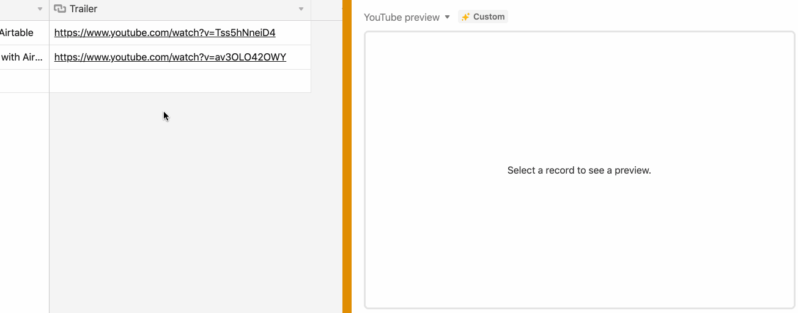

# Engine Room

When the user selects a cell in grid view which contains an attachment or URL of one of the supported filetypes,
this block will preview it. This block supports previews for the following files; gltf, glb and obj.

## See the block running

